```mermaid
flowchart LR
    %% Organisations and Users
    Organisation[Organisation
    ID
    name
    ] -->|orgId → Organisation._id| User[User
    ID
    email
    role
    orgId
    ]

    Organisation -->|orgId → Organisation._id| Device[Device
    ID
    imei
    alertEmails
    alertPhones
    orgId
    modelType
    ]

    %% Device Models
    DeviceModel[DeviceModel
    ID
    modelName
    portCount
    ] -->|modelType → DeviceModel._id| Device

    %% Device relations
    Device -->|deviceId → Device._id| Port[Port
    ID
    name
    type
    minThreshold
    maxThreshold
    deviceId
    ]
    Device -->|deviceId → Device._id| Value[Value
    ID
    ts
    rawValue
    calibratedValue
    deviceId
    portId
    ]
    Device -->|deviceId → Device._id| Alert[Alert
    ID
    triggeredAt
    message
    deviceId
    portId
    ]

    %% Port relations
    Port -->|portId → Port._id| Value
    Port -->|portId → Port._id| Alert

```

Got it 👍
Let’s completely restructure the documentation so it’s **developer-friendly** and **business-driven**.

---

# 📘 System Architecture & Data Flow Documentation

## 1. Business Flow

Here’s how the system works in real life from **device manufacturing** to **alerting users**:

### Step 1: Device Creation

* Our company manufactures a **Device**.
* Each device is assigned:

  * **IMEI** (unique identifier – never changes).
  * **Model Type** (fixed once assigned).
* At this point, the device exists in our system but isn’t owned by any organisation yet.

---

### Step 2: Device Purchase & Organisation Onboarding

* When an **Organisation (Org)** buys devices:

  * If the organisation does not exist → we create it.
  * We also create an **OrgAdmin User**.
  * Devices purchased are linked to the organisation.
* **Important rule:**

  * `IMEI` and `ModelType` are immutable.
  * Other details like orgId, installation info, etc., get updated here.

---

### Step 3: Port Configuration

* Every **Device** has one or more **Ports**.
* Ports can be configured by the organisation admin:

  * `name`, `protocolType` (RS-485, Modbus, MQTT etc.)
  * `thresholds` for alerts (min, max).
  * `customMessages` for exceeding thresholds.

---

### Step 4: Alerts & Notifications

* When data flows from sensors through ports → system checks against thresholds.
* If conditions are violated:

  * Alerts are generated.
  * Sent via **configured channels**: Email / SMS / Webhook.
* Each **Device** maintains an array of alertContacts:

  * `emails[]`
  * `phoneNumbers[]`

---

### Step 5: Future Extensions (Planned)

* Device lifecycle management (installation → maintenance → decommission).
* Device health metrics.
* Billing & subscription model for Orgs.

---

## 2. Data Models & Relationships

### **Organisation**

```ts
Organisation {
  _id: ObjectId
  name: String
  address: String
  createdAt: Date
  updatedAt: Date
  admins: [UserId]   // Organisation admins
}
```

---

### **User**

```ts
User {
  _id: ObjectId
  orgId: ObjectId
  email: String
  phone: String
  role: Enum("OrgAdmin", "OrgUser", "CompanyAdmin")
  createdAt: Date
}
```

---

### **Device**

```ts
Device {
  _id: ObjectId
  imei: String   // unique, immutable
  modelType: String
  orgId: ObjectId? // nullable until assigned
  registeredAt: Date
  alertContacts: {
    emails: [String]
    phoneNumbers: [String]
  }
  ports: [PortId]   // references Port documents
}
```

---

### **Port**

```ts
Port {
  _id: ObjectId
  deviceId: ObjectId
  name: String
  protocolType: Enum("RS-485", "Modbus", "MQTT", "Other")
  thresholds: {
    min: Number?
    max: Number?
  }
  customMessage: String?   // message if threshold is breached
}
```

---

### **Alert**

```ts
Alert {
  _id: ObjectId
  deviceId: ObjectId
  portId: ObjectId
  triggeredAt: Date
  value: Number
  message: String
  sentTo: {
    emails: [String]
    phoneNumbers: [String]
  }
}
```

---

## 3. Entity Relationship Diagram (Mermaid)

```mermaid
erDiagram
    Organisation ||--o{ User : "orgId → Organisation._id"
    Organisation ||--o{ Device : "orgId → Organisation._id"

    User ||--|| Organisation : "belongs_to"

    DeviceModel ||--o{ Device : "modelType → DeviceModel._id"
    Device ||--o{ Port : "deviceId → Device._id"
    Device ||--o{ Value : "deviceId → Device._id"
    Device ||--o{ Alert : "deviceId → Device._id"

    Port ||--o{ Value : "portId → Port._id"
    Port ||--o{ Alert : "portId → Port._id"

    Organisation {
      string _id
      string name
    }

    User {
      string _id
      string email
      enum role
      objectId orgId "ref: Organisation"
    }

    DeviceModel {
      string _id
      string modelName
      int digitalPorts
      int analogPorts
    }

    Device {
      string _id
      string imei
      objectId modelType "ref: DeviceModel"
      objectId orgId "ref: Organisation"
      string[] alertEmails
      string[] alertPhones
    }

    Port {
      string _id
      objectId deviceId "ref: Device"
      string name
      enum type "analog | digital"
      number minThreshold
      number maxThreshold
    }

    Value {
      string _id
      date ts
      objectId deviceId "ref: Device"
      objectId portId "ref: Port"
      number rawValue
      number calibratedValue
    }

    Alert {
      string _id
      objectId deviceId "ref: Device"
      objectId portId "ref: Port"
      date triggeredAt
      string message
    }

```



---

# 📘 Quick Explanation

* **Organisation**

  * Owns **Users** and **Devices**.

* **User**

  * Belongs to one Organisation, has roles.

* **DeviceModel**

  * Defines the **template of ports** (e.g., 4 digital + 6 analog).
  * Devices reference a DeviceModel.

* **Device**

  * Has a unique **IMEI** + modelType reference.
  * Belongs to one Organisation.
  * Has multiple **Ports**.
  * Generates **Values** and **Alerts**.

* **Port**

  * Belongs to a Device.
  * Has thresholds (min/max).
  * Produces **Values** and can trigger **Alerts**.

* **Value**

  * Time-series measurement for a Port at a timestamp.

* **Alert**

  * Triggered when a Port breaches thresholds.
  * References both Device + Port.

---


